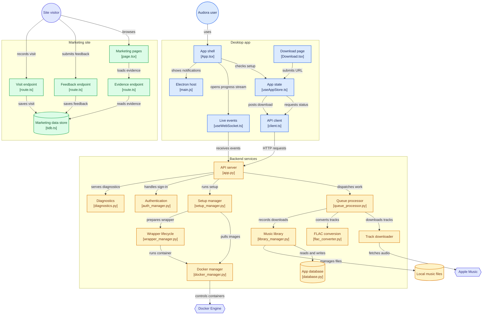

# 🎵 Audora — 🍎 Music Lossless Downloader

Download your 🍎 Music library in **lossless quality** and keep it forever — even offline.

> **You need an active 🍎 Music subscription to use Audora.**

---

## What is Audora?

Audora lets you download any 🍎 Music album, playlist, or track in **FLAC (lossless)** format — full lossless quality, with no loss compared to the original. Your downloads are saved as `.flac` files that play in Audora itself, plus VLC, foobar2000, and most modern music players.

---

## Before You Start

You will need:
- A Windows 10 or Windows 11 PC (x64), or a Linux x64 computer
- An active **🍎 Music subscription**
- **Some free disk space** for setup
- An internet connection
- Docker Desktop (Windows) or a running Docker Engine (Linux)

---

## Step 1 — Download Audora

1. Go to the [Releases page](https://github.com/utkarsh-wadalkar/Audora/releases)
2. Download the release file for your operating system:

```text
Windows
└── Windows x64
    └── Audora Setup 2.0.0.exe

Linux
├── Ubuntu / Debian
│   └── audora_2.0.0_amd64.deb
└── Other distros
    └── Audora-2.0.0.AppImage
```

3. Save it somewhere easy to find (like your Desktop).

## Step 2 — Install Audora

### Windows

1. Double-click the downloaded **`.exe`** installer
2. If Windows shows a blue warning screen saying *"Windows protected your PC"*:
   - Click **"More info"**
   - Click **"Run anyway"**
3. Follow the installer — click **Next** → **Install** → **Finish**

> This warning appears because Audora is new and not yet signed with a paid certificate. It is safe to install.

### Linux

Install the Debian package with your package manager, or mark the AppImage as
executable and run it. Ensure Docker Engine is installed and running before
opening Audora.

---

## Step 3 — First-Time Setup

When you launch Audora for the first time, a **Setup Wizard** will open automatically.

### The wizard will:

**✓ Check your system**
It checks that your PC meets the requirements. Just wait — this is automatic.

**✓ Check Docker** *(if not already installed)*
Audora uses Docker in the background. On Windows it can help you find Docker
Desktop; on Linux, install and start Docker Engine before opening Audora.

- If prompted, click **Install**
- Docker may ask you to **restart your PC** — go ahead and restart
- After restarting, open Audora again and the wizard will continue

**✓ Download required components**
Audora downloads the tools it needs. This may take a few minutes depending on your internet speed.

**✓ Sign in to 🍎 Music**
Enter your 🍎 ID email and password.

- If you have **two-factor authentication** turned on, you'll get a 6-digit code on your iPhone or trusted device. Enter it when Audora asks.
- Your login is saved securely. You won't need to sign in again.

**✓ Setup Complete**
Click **Open App** and you're ready to go!

---

## Step 4 — Download Music

1. Open **🍎 Music**
2. Find an album, playlist, or track you want to download
3. Copy the sharable URL of that album, playlist, or track you want to download
   *Example:*
   ```
   https://music.apple.com/us/album/thriller/269572838
   ```

4. Open **Audora**
5. Paste the URL into the box on the Download page
6. Click **Download**
7. Watch the progress — each track will download one by one
8. When done, Audora will notify you ✓

---

## Where Are My Downloads?

Your files are saved here by default:

```
D:\MusicDownload\
```

Inside, they're organised like this:

```
MusicDownload/
└── Michael Jackson/
    └── Thriller/
        ├── 01. Wanna Be Startin' Somethin'.flac
        ├── 02. Baby Be Mine.flac
        └── ...
```

You can change the download folder in **Settings** inside Audora.

---

## Playing Your Downloads

Your files are `.flac` (lossless). Audora downloads the lossless source from
Apple Music and converts it to FLAC automatically — you'll see a short
"Converting to FLAC" stage after the download finishes, and the track is
playable the moment it completes. They play in Audora itself:
Play tracks directly inside Audora using the built-in player.
But you can also use
| Player | Where to get it |
|--------|----------------|
| **VLC** *(recommended)* | [videolan.org](https://www.videolan.org) |
| **foobar2000** | [foobar2000.org](https://www.foobar2000.org) |

---

## Troubleshooting

### "Docker Desktop is not running"
- Open **Docker Desktop** from your Start Menu and wait for it to finish loading (the whale icon in your taskbar should stop animating)
- Then try again in Audora

### "Signed out / Login required"
- Go to **Settings** in Audora and click **Sign in to 🍎 Music** again

### Download says "Unavailable"
- The track may not be available in your region, or it may have been removed from 🍎 Music

### Audora won't open after restart
- Make sure **Docker Desktop** is running first, then open Audora

### Something else is wrong
- Open the **Logs** page inside Audora and take a screenshot
- Share it when asking for help

---

## Frequently Asked Questions

**Do I need to keep my 🍎 Music subscription?**
Yes. Audora downloads tracks using your active 🍎 Music subscription. If your subscription ends, you won't be able to download new music — but files you've already downloaded will still play.

**Is this legal?**
Audora is intended for personal use only. Downloading music you have legitimately paid for (via subscription) for personal offline listening is a common practice, but you are responsible for complying with 🍎's Terms of Service in your region.

**Will this work on Mac or Linux?**
Audora supports Linux x64 as well as Windows x64. macOS is not supported.

**Can I download my entire library at once?**
Yes — paste a playlist URL and Audora will download every track in it.

**How much space do I need?**
Lossless FLAC files are roughly **30–50 MB per track**.

---

## Requirements Summary

| Requirement | Details |
|-------------|---------|
| OS | Windows 10/11 x64 or Linux x64 |
| Disk space | 4 GB for setup |
| Internet | Required for downloading |
| 🍎 Music | Active subscription required |
| Docker | Docker Desktop on Windows; a running Docker Engine on Linux |

---

## Credits

Audora is built on top of:
- [zhaarey/apple-music-downloader](https://github.com/zhaarey/apple-music-downloader)
- [WorldObservationLog/wrapper](https://github.com/WorldObservationLog/wrapper)

- *A Big Thank's to* ♥ [*zhaarey*](https://github.com/zhaarey) & [*WorldObservationLog*](https://github.com/WorldObservationLog) ♥ 
---

Made with 🎧 by [Utkarsh-Wadalkar](https://github.com/utkarsh-wadalkar)

***
## Architecture Diagram


